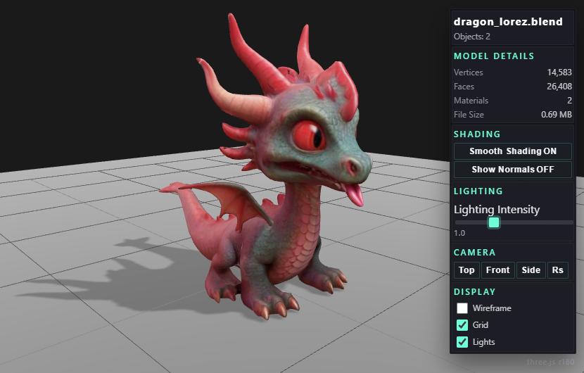

## Introduction

A fork of https://github.com/berloop/blender-web-viewer with support for  > three.js 180.



This addon allows you to preview your Blender scenes in a web browser and export them as standalone web packages.


## Prerequisites

- Blender 4.0 or newer
- Web browser with WebGL support (Chrome, Firefox, Edge, Safari)
- For development: Python 3.7+ (ideally 3.11) & VS Code

## Installation

1. Download the addon from the release section (do not extract it)
2. Open Blender and go to Edit > Preferences
3. Select the "Add-ons" tab
4. Click the down-pointing-arrow button at the top right and choose "Install Manually"

## Development

During development you can rebuild the web viewer directly into the installed addon directory (Windows Blender 5.0 default location):

```bash
cd web_vite
npm install
npm run build
```

The build process performs these steps automatically:

- Cleans `C:\Users\Administrator\AppData\Roaming\Blender Foundation\Blender\5.0\extensions\user_default\blendxweb2\web`
- Emits the latest Vite bundle into that directory so Blender serves the new assets immediately
- Copies `__init__.py`, `blender_manifest.toml`, `image.png`, `README.md`, and the `server/` folder into the addon directory so Blender loads the full toolchain

> **Note:** On non-Windows systems set `BLENDXWEB_CUSTOM_OUTDIR` to the absolute addon target path before running the build commands so assets deploy to the correct directory.

## Development notes

### Python backend server
The Python helper server spins up a threaded `http.server` instance with CORS and cache-busting headers, serving generated files from a specified directory and port for quick previews launched from Blender.

### Vite/Three.js frontend architecture
The Vite app boots through main.js, which warns when loaded over the file protocol, runs setupViewer(), and decorates the UI with the current Three.js revision badge. Viewer state is centralized in state.js, exposing setters/getters for DOM caches, scene graph handles, animation mixers, and reference camera poses. Scene orchestration in scene.js initializes the renderer, camera, controls, lighting, responsive resizing, Draco-backed GLTF loading, animation preparation, and render loop. User interactions are wired through controls.js which hooks the UI controls to rendering actions defined in actions.js; animation ticking lives in tickAnimations(). UI state updates (loading overlay, stats, sliders, shading labels) are managed by ui.js.

### System flow


## License

Copyright (C) 2025 Egret Software egretfx@gmail.com

Permission is hereby granted, free of charge, to any person obtaining a copy of this software and associated documentation files (the "Software"), to deal in the Software without restriction, including without limitation the rights to use, copy, modify, merge, publish, distribute, sublicense, and/or sell copies of the Software, and to permit persons to whom the Software is furnished to do so, subject to the following conditions:

The above copyright notice and this permission notice shall be included in all copies or substantial portions of the Software.
